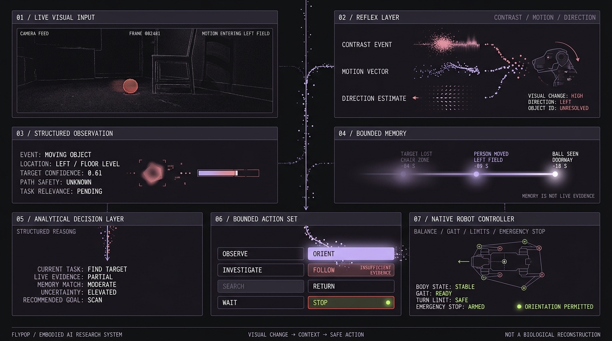
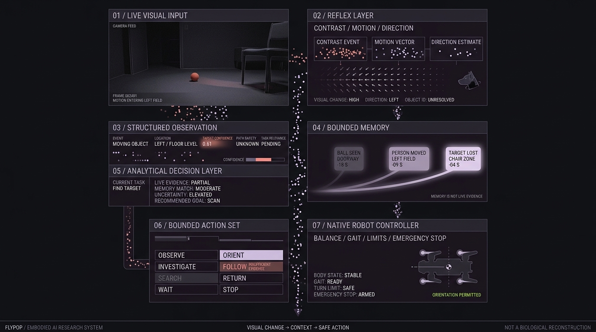

<div align="center">


# FlyPop

### A physical AI system with a small point of view.

[](https://www.python.org/)
[](tests/)
[](LICENSE)
[](docs/experiments.md)

[Quick start](#quick-start) · [Architecture](#architecture) · [Demo](#demo) · [Roadmap](#roadmap)

</div>

FlyPop explores what happens when a physical robot combines a fly-inspired visual reflex layer, structured memory, analytical reasoning, and bounded action selection.

The robot does not need to understand an entire room before it can notice that something changed inside it.

## What FlyPop is

FlyPop combines:

- A quadruped robot body for safe real-world movement.
- A simplified fly-inspired reflex layer for contrast, motion, and directional change.
- A higher-level analytical layer for context and decision-making.
- Structured memory for comparing current evidence with previous observations.
- Human-readable traces that separate observation, inference, uncertainty, and action.

FlyPop is not a literal fly brain inside a robot dog. It is not a complete Drosophila reconstruction, a dog brain, consciousness, or general intelligence. Biology provides architectural inspiration; the implementation is a simplified engineering model that must be tested against baselines.

## Quick start

Requires Python 3.11+.

```bash
python -m venv .venv
source .venv/bin/activate
pip install -e ".[dev]"
python examples/synthetic_demo.py
pytest
```

The repository is dry-run-first. The demo does not require a camera, a robot, a network connection, or model credentials.

## Demo

The core loop is:

```text
observation -> memory lookup -> bounded action -> outcome -> memory update
```

Example output:

```text
observation=0.05/0.05 -> action=wait
observation=0.82/0.25 -> action=investigate
observation=0.82/0.25 -> action=investigate
observation=0.20/0.78 -> action=orient
```

Every decision includes a confidence value, an uncertainty description, and reasons that can be inspected after the run.

## Architecture



```text
camera / video
      |
      v
reflex layer: contrast, motion, direction
      |
      v
structured observation + uncertainty
      |
      v
bounded memory of relevant prior events
      |
      v
analytical decision layer
      |
      v
observe | orient | investigate | follow | search | return | wait | stop
      |
      v
native robot controller: balance, gait, limits, emergency stop
```

The analytical layer does not control individual motors, joints, torque, gait, or balance. A real robot adapter must remain behind the bounded action interface and preserve the platform's native safety controller.

## Action vocabulary

| Action | Purpose |
| --- | --- |
| `observe` | Keep monitoring the current view. |
| `orient` | Turn toward a detected change without committing to forward motion. |
| `investigate` | Move toward a flagged region to gather more evidence. |
| `follow` | Track a moving signal or object. |
| `search` | Explore when no clear target is available. |
| `return` | Move back toward a known reference point. |
| `wait` | Pause and request another observation. |
| `stop` | Halt immediately. |

## Safety boundary

- The default robot adapter is dry-run.
- The action vocabulary is an allowlist.
- `stop` is always available.
- Unknown actions are rejected.
- No raw motor commands are generated by the analytical layer.
- Hardware integration remains a separate implementation task until the exact platform and protocol are verified.

## Repository layout

```text
flypop/
  models.py       Typed domain objects
  reflex.py       Simplified visual change detector
  memory.py       Bounded event memory
  decision.py     Deterministic bounded policy
  bridge.py       Dry-run robot adapter and trace logger
  cli.py          Command-line demo entry point
examples/
  synthetic_demo.py
tests/
  test_flypop.py
docs/
  architecture.md
  experiments.md
assets/
  github1.jpg
  github2.jpg
```

## Roadmap



- [x] Typed observation and action models.
- [x] Simplified visual reflex baseline.
- [x] Bounded memory and decision traces.
- [x] Dry-run robot adapter.
- [x] Synthetic demo and tests.
- [ ] Add a real camera adapter.
- [ ] Add a verified platform-specific action adapter.
- [ ] Compare memory against a stateless baseline.
- [ ] Run controlled physical experiments.
- [ ] Document failures and uncertainty alongside successful runs.

## Scientific integrity

This project distinguishes between biological research, engineering inspiration, implemented prototype behavior, future hypotheses, and demonstrated results.

Claims about performance, autonomy, hardware, or biological fidelity should be supported by reproducible experiments. Until then, they remain hypotheses to test.

## License

MIT. See [LICENSE](LICENSE).
